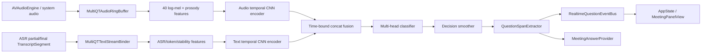

# MultiQT Final Consolidation Plan

Status: active execution plan
Owner: Notchly realtime Q&A
Target: trained multilingual audio+text question tracker, local-first, Core ML deployable, precision-first

## Why this exists

The current Notchly Q&A pipeline has the right product shape:

`MeetingSessionManager.append(_:) -> RealtimeQuestionAnsweringEngine.ingest(...) -> QuestionDetectionService -> QuestionClassifier -> MeetingAnswerProvider -> RealtimeQuestionEventBus -> AppState / MeetingPanelView`

The current detector is not yet the final target. It is a MultiQT-lite implementation: textual rules, calibrated local scoring, partial stability, and redacted shadow logging. The final target is a trained MultiQT-style model that jointly learns from streamed audio and noisy ASR text, then exports to Core ML and becomes the primary local decision engine.

This plan is the authoritative consolidation path. The goal is not "more rules"; the goal is a trained, measured, multilingual, low-latency detector that only triggers answer generation for real answerable questions.

## Current repo checkpoint

The repo now includes a first trained Core ML checkpoint:

- `NotchCopilot/Resources/Models/notchly-multiqt-v1.mlmodelc`
- `NotchCopilot/Resources/Models/notchly-multiqt-v1.metadata.json`

This checkpoint is a bootstrap model, not the final production-quality endpoint. It was trained from `qa_intent_gold.jsonl` converted into a synthetic MultiQT manifest with macOS `say` audio. It proves the complete path: dataset validation, audio+text training, threshold calibration, Core ML export, app bundling, runtime load, and Swift inference. It does not replace the required consented real-meeting dataset.

Validation on the synthetic held-out splits:

| Split | TP | FP | FN | TN | Precision | Recall | p95 |
| --- | ---: | ---: | ---: | ---: | ---: | ---: | ---: |
| test | 71 | 0 | 0 | 121 | 1.0000 | 1.0000 | 1.279 ms |
| hard_test | 47 | 0 | 0 | 72 | 1.0000 | 1.0000 | 1.202 ms |

The bundled model uses text tokens, log-mel audio features, and scalar ASR/temporal/language features. The runtime still falls back safely to MultiQT-lite if the model or metadata cannot be loaded.

Primary reference:
- MultiQT paper: https://aclanthology.org/2020.acl-main.215.pdf
- arXiv page: https://arxiv.org/abs/2005.00812

Key paper constraints that map directly to Notchly:
- Streamed audio and noisy ASR text are two separate modalities.
- The model uses online temporal binding between audio and ASR output instead of offline global alignment.
- The basic architecture uses independent convolutional encoders for audio/text and fuses by concatenation.
- Audio inputs use 40 log-mel features with 20 ms windows and 10 ms stride.
- The original paper found multimodal audio+text models outperform audio-only and text-only variants, and tensor fusion did not clearly beat simple concatenation.
- Real-time processing is a core requirement, not an afterthought.

## Non-negotiable product gates

The model is not considered shippable until all gates are met on held-out data and in-app replay:

| Gate | Required value |
| --- | --- |
| Overall precision | >= 0.995 before enforcement |
| Overall recall | >= 0.970 before enforcement |
| Critical negative FP | 0 on small talk, operational checks, rhetorical, reported, self-answered, fragments, titles |
| Per-language precision | >= 0.990 for pt-BR, en-US, es-ES, ja-JP |
| Per-language recall | >= 0.950 for pt-BR, en-US, es-ES, ja-JP |
| Local decision p95 | <= 60 ms on target Mac hardware |
| Local decision p99 | <= 100 ms |
| Partial early-fire FP | 0 on unstable partial streams |
| Final replacement | final segment merges/replaces matching partial without duplicate UI item |
| Privacy | no raw audio persisted by default; redacted shadow logs only |
| UI | no infinite loading; terminal stage always ready, failed, or cancelled |

The runtime hard gate remains:

`responseNeeded && complete && !rhetorical && priority != .low`

## Target architecture

The final architecture keeps the existing pipeline and replaces the local decision core.



### Model heads

The model must predict more than a binary question flag:

| Head | Output |
| --- | --- |
| `intentLabel` | answerable_question, action_request, status, risk, technical_decision, technical_explanation, deadline, ownership, follow_up, business, statement, small_talk, operational_check, rhetorical, reported_question, self_answered, fragment, title_noise |
| `responseNeeded` | calibrated binary probability |
| `complete` | complete vs partial/incomplete |
| `questionSpan` | start/end token or frame span for clean extraction |
| `criticalNegative` | auxiliary probability for the hard-block classes |
| `language` | auxiliary language head or language-conditioned calibration bucket |

### Runtime layers

1. `MultiQTAudioRingBuffer`
   - In-memory only by default.
   - Retains the last 8-12 seconds per meeting/source.
   - Supports deterministic fixture injection for tests.

2. `MultiQTTextStreamBinder`
   - Converts partial/final ASR segments into a stable timeline.
   - Tracks rewrite count, terminal pause, ASR confidence, source, speaker, language, and segment replacement.

3. `MultiQTFeatureExtractor`
   - 40 log-mel, 20 ms window, 10 ms stride.
   - RMS, peak, clipping, silence/tooQuiet, noise floor, gap count.
   - F0/pitch features when available: median, range, final slope, voiced ratio.
   - Text features: token ids, char n-grams or byte/BPE ids, punctuation, code/acronym signals, ASR stability.

4. `MultiQTModelRunner`
   - Loads `notchly-multiqt-v1.mlmodelc`.
   - Loads sidecar metadata from `notchly-multiqt-v1.metadata.json`.
   - Uses `MLModelConfiguration.computeUnits = .all` in normal mode, CPU-only benchmark mode for reproducibility.
   - Falls back to MultiQT-lite only when model is missing or explicitly disabled.
   - Current repo integration point: `CoreMLQuestionMultiQTModelRunner` feeds trained predictions into `QuestionClassifier` in shadow/enforced modes.
   - Runtime audio contract: `QuestionAudioLogMelFeature` carries captured log-mel features when available; otherwise the runner uses a redacted numeric signal proxy derived from RMS, peak, energy, noise, duration, finality, partial stability, and gaps. The proxy is not sufficient for the final gate dataset, but it prevents a bundled model from becoming text-only when raw audio is unavailable.

5. `MultiQTDecisionSmoother`
   - Requires confidence hysteresis.
   - Blocks unstable partials.
   - Promotes stable partials only after repeated evidence or terminal pause.
   - Merges partial/final duplicates by normalized span and segment id.

6. `QuestionClassifier`
   - Uses trained output as primary when available.
   - Keeps rhetorical/operational/reported/self-answered filters as hard-block safety, not as primary detection.

## Data plan

The final model cannot be truthfully claimed without a real multimodal dataset. The repo fixtures are useful regression data, but they are not enough to train the extreme-quality model.

### Dataset sources

| Source | Use |
| --- | --- |
| Existing `qa_intent_gold.jsonl` | text regression, critical negatives, language coverage |
| Existing `copilot_partial_streams.jsonl` | ASR partial stability and dedup behavior |
| Synthetic TTS audio generated from gold rows | bootstrap audio-text alignment, latency harness |
| Local manual meeting captures with opt-in consent | in-domain real ASR/audio labels |
| Public speech/dialog-act corpora where license permits | pretraining and negative diversity |
| Shadow logs redacted from real usage | active learning queue, no raw text/audio persisted unless opted in |

### Label schema

Every training example must be a time-aligned JSONL record:

```json
{
  "id": "qa-ptbr-000001",
  "language": "pt-BR",
  "audio_path": "relative/path.wav",
  "sample_rate": 16000,
  "transcript": "Quais sao os principios SOLID de programacao",
  "asr_transcript": "Quais sao os principios solid de programacao",
  "start_ms": 1200,
  "end_ms": 3900,
  "is_partial": false,
  "asr_confidence": 0.94,
  "speaker_role": "participant",
  "label": "technical_explanation",
  "response_needed": true,
  "critical_negative": false,
  "complete": true,
  "question_span": [0, 47],
  "source": "manual|synthetic|shadow_redacted|public",
  "split": "train|dev|test|hard_test"
}
```

### Annotation rules

Annotators must label the *meeting action*, not the grammar:

- Positive only when Notchly should answer now.
- Negative when the text is a title, fragment, reported question, self-answer, rhetorical, small talk, or operational check.
- If a question is answered by the speaker within the same turn, label `self_answered`.
- If a question is quoted or summarized, label `reported_question`.
- If the question asks about audio/screen/meeting mechanics, label `operational_check`.
- If the utterance is a heading or topic phrase, label `title_noise`.
- Extract `question_span` exactly as the user should see it.

### Required data volume before enforcement

Minimum gate dataset:

| Bucket | Minimum examples |
| --- | --- |
| pt-BR positive | 2,000 |
| en-US positive | 2,000 |
| es-ES positive | 1,500 |
| ja-JP positive | 1,500 |
| Critical negatives per language | 3,000 |
| Partial streams per language | 1,000 |
| Real audio examples per language | 500 |
| Hard adversarial examples | 2,000 total |

The model can be trained earlier, but `qaMultimodalMode.enforced` cannot become the default until the gate dataset passes.

## Training plan

Training should happen outside the app, under `Tools/multiqt/`.

Implemented entrypoints in the repo:

```text
Tools/multiqt/build_synthetic_manifest.py
Tools/multiqt/train.py
Tools/multiqt/predict.py
Tools/multiqt/evaluate.py
Tools/multiqt/export_coreml.py
```

`build_synthetic_manifest.py` converts the existing multilingual QA gold fixture into train/dev/test/hard_test manifests and can synthesize local macOS speech audio. This is a bootstrap/regression set only; final enforcement still requires consented real meeting audio, public/license-compatible audio, or manually reviewed local datasets.

### Baselines

These must all run in CI or local benchmark:

1. Text-only deterministic baseline: current `QuestionClassifier`.
2. Text-only neural baseline: lightweight multilingual text classifier.
3. Audio-only neural baseline: log-mel CNN.
4. MultiQT audio+text concat: final candidate.
5. MultiQT audio+text concat + multitask heads: final expected winner.

Tensor fusion is not the default because the paper did not show a reliable improvement over concat and it is costlier. It can be kept as an experiment only if concat fails.

### Model family

The first production candidate is intentionally small:

- Audio encoder: temporal CNN over 40 log-mel frames.
- Text encoder: byte/BPE or char temporal CNN over ASR stream.
- Fusion: per-timestep concatenation.
- Classifier: dense layers with dropout during training.
- Heads: intent, responseNeeded, complete, criticalNegative, span.
- Calibration: temperature scaling per language plus global threshold sweep.

### Objective

Use a weighted multitask loss:

`L = L_intent + 1.5 * L_responseNeeded + 1.25 * L_criticalNegative + 0.75 * L_complete + 0.75 * L_span`

Critical negative false positives must be more expensive than false negatives. The production threshold is selected for precision first, then recall.

### Augmentation

Use augmentation to avoid brittle lexical matching:

- ASR corruption: drops, substitutions, punctuation removal, casing changes.
- Noise: background speech, room noise, clipping, tooQuiet.
- Timing: partial truncation, terminal pause variation, delayed final segment.
- Language: accent/locale variants, code-switching, transliteration where realistic.
- Lexical counterfactuals: same words in statement vs real question.

## Export and app integration

### Core ML artifact contract

The exported model must be named:

`notchly-multiqt-v1.mlmodelc`

Inputs:

| Name | Shape/type |
| --- | --- |
| `audio_logmel` | Float32 `[1, 40, max_frames]` |
| `text_tokens` | Int32 `[1, max_tokens]` |
| `scalars` | Float32 `[1, scalar_count]` |

Outputs:

| Name | Shape/type |
| --- | --- |
| `response_logit` | Float32 `[1]` |
| `label_logits` | Float32 `[label_count]` |
| `complete_logit` | Float32 `[1]` |
| `rhetorical_logit` | Float32 `[1]` |

Required metadata sidecar:

```json
{
  "labels": ["answerable_question"],
  "vocab": { "<pad>": 0, "<unk>": 1 },
  "threshold": 0.5,
  "config": {
    "max_tokens": 96,
    "max_frames": 600,
    "scalar_count": 7
  },
  "audio_feature_contract": {
    "bands": 40,
    "raw_audio_persisted": false,
    "runtime_fallback": "signal_proxy"
  }
}
```

### Integration switch

Add a distinct runtime mode:

```swift
enum QAMultimodalMode {
    case off
    case shadow
    case enforced
}
```

Runtime behavior:

- `off`: current text/local rules only.
- `shadow`: run trained model and log redacted scores, but do not alter decisions.
- `enforced`: trained model decides; hard-block filters still suppress unsafe positives.

If the model is missing or fails load, enforced mode must degrade to shadow/off with a visible diagnostic and no crash.

## Evaluation plan

### Required commands

Core repo:

```sh
xcodebuild -skipPackagePluginValidation -skipMacroValidation -scheme NotchCopilot -destination 'platform=macOS' test
```

Training and model:

```sh
python3 Tools/multiqt/train.py --manifest Data/multiqt/train.jsonl --dev Data/multiqt/dev.jsonl --test Data/multiqt/test.jsonl --out Artifacts/multiqt
python3 Tools/multiqt/export_coreml.py --checkpoint Artifacts/multiqt/best.pt --out NotchCopilot/Resources/Models/notchly-multiqt-v1.mlpackage
python3 Tools/multiqt/evaluate.py --model Artifacts/multiqt/best.pt --manifest Data/multiqt/hard_test.jsonl
```

In-app replay:

```sh
QA_REPLAY=1 xcodebuild -skipPackagePluginValidation -skipMacroValidation -scheme NotchCopilot -destination 'platform=macOS' test
```

### Metrics that must print

- TP / FP / FN / TN
- precision / recall / F1 / PR-AUC
- per-language precision and recall
- per-class confusion matrix
- critical negative FP list
- p50 / p95 / p99 by stage:
  - audio feature extraction
  - text binding
  - Core ML inference
  - decision smoothing
  - total local decision
- example-level error report:
  - top false positives
  - top false negatives
  - unstable partials
  - self-answered cases
  - reported-question confusions

## UI and product acceptance

The trained model is not enough. The meeting panel must prove the user experience:

- Listening while transcript flows.
- Understanding when a candidate enters the local model.
- Retrieving Context only after `responseNeeded` is accepted.
- Drafting only after context is ready.
- Ready / Failed / Cancelled always terminal.
- Dismiss removes current and advances queue.
- Copy/save do not include hidden evidence blocks in Q&A answer body.
- Transcript/Answer toggle remains stable.
- No duplicate partial/final question cards.
- No stale loading after provider failure, local-only failure, timeout, or self-answer cancellation.

## Rollout sequence without lowering the target

This is a quality-gated sequence, not a scope reduction.

1. Build the dataset and training toolchain.
2. Train text-only and audio-only baselines.
3. Train MultiQT concat and MultiQT multitask variants.
4. Export the best checkpoint to Core ML.
5. Integrate `MultiQTModelRunner` in shadow mode.
6. Run shadow logging against real meetings with redaction.
7. Compare against current text baseline.
8. Promote to enforced only when all gates pass.
9. Keep MultiQT-lite as fallback and diagnostic baseline.

## Immediate repo deliverables

The next committed artifacts must include:

- `docs/MULTIQT_FINAL_CONSOLIDATION_PLAN.md`
- `Tools/multiqt/README.md`
- `Tools/multiqt/dataset.schema.json`
- `Tools/multiqt/labels.json`
- `Tools/multiqt/train.py`
- `Tools/multiqt/export_coreml.py`
- `Tools/multiqt/evaluate.py`
- Swift interfaces:
  - `MultiQTModelInput`
  - `MultiQTModelOutput`
  - `MultiQTModelRunner`
  - `MultiQTDecisionSmoother`
  - `MultiQTTrainingFeatureSnapshot`
- Tests:
  - model-missing fallback
  - shadow logging redaction
  - Core ML output mapping
  - partial/final dedup with model outputs
  - critical negative zero-FP gate
  - per-language benchmark gate

## Definition of done

This goal is complete only when current evidence proves all of the following:

- A trained Core ML MultiQT model is bundled or reproducibly generated.
- The model uses audio+text features, not text-only rules.
- The model is evaluated against text-only and audio-only baselines.
- The multimodal model improves or matches precision and improves recall under the production gate.
- Critical negatives have zero false positives on hard-test data.
- Per-language gates pass for pt-BR, en-US, es-ES, ja-JP.
- p95 local decision latency is <= 60 ms and p99 <= 100 ms on target hardware.
- Runtime uses the trained model in `shadow` and `enforced` modes with safe fallback.
- UI E2E proves the live meeting flow.
- Documentation reflects the real state and does not call MultiQT-lite a trained MultiQT model.
